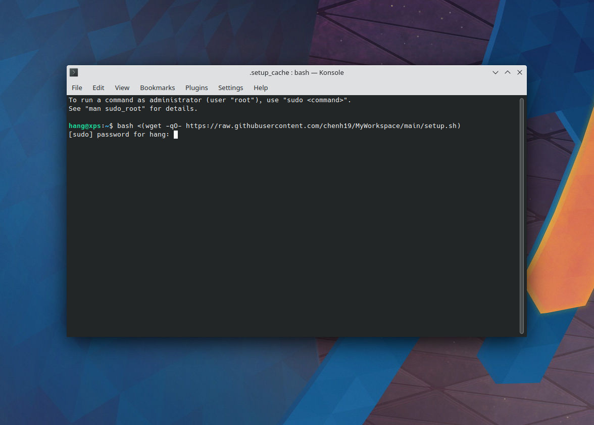

## Fresh Install and Configuration of Kubuntu for Work

### [1/5] Create a bootable USB drive
- Download [**balenaEtcher**](https://www.balena.io/etcher/)  
- Download [**Kubuntu**](https://kubuntu.org/getkubuntu/)  
- Flash a USB drive with the Kubuntu iso image:  


### [2/5] Boot into the USB drive
- Press ```F12``` when the computer is booting up  
- Select the corresponding UEFI boot option (e.g., USB HDD: SanDisk) and press ```Enter```  

### [3/5] Install Kubuntu

- Once boot into Kubuntu installer, select **Install Kubuntu**":  


- **Continue** with default keyboard setting:  


- **Continue** without connecting to internet:  


- Select **Normal installation** and check **Install third-party software for graphics and Wi-Fi hardware and additional media formats** option, then **Continue**:   


- Select **Guided - use entire disk** and **Install Now** (if you plan to install multiple OS on a single physical drive, you might select **Manual**):  


- **Continue** to confirm partition formatting:  


- Set **Region** and **Time Zone**, then **Continue**:  


- Set user account, then **Continue**:  


- Installation might take some time:  


- Once finished, it will prompt a restart:  


### [4/5] Reboot the system
- Once log out, it will prompt "**Please remove the installation meduim, then press ENTER**", simply unplug the USB drive and press ```Enter```  

### [5/5] Configuration
- Connect to internet
- Copy the below command, paste in [**Konsole**](https://konsole.kde.org/) (terminal) and press ```Enter```:  
```
bash <(wget -qO- https://raw.githubusercontent.com/chenh19/MyWorkspace/main/setup.sh)
```
- Input user password and press ```Enter``` to run:  


#### Note:
- It will ask a few questions in terms of **configuration preferences**. If you didn't notice immediately, it will simply pause and wait for your input.
