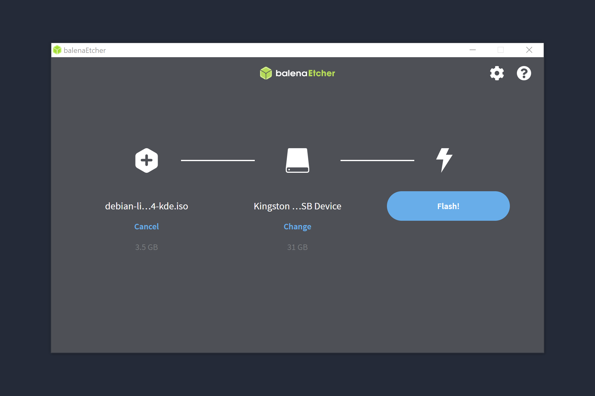
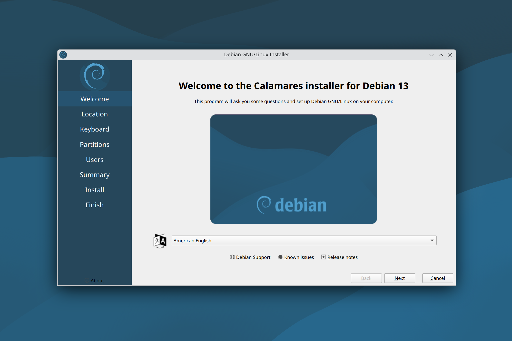
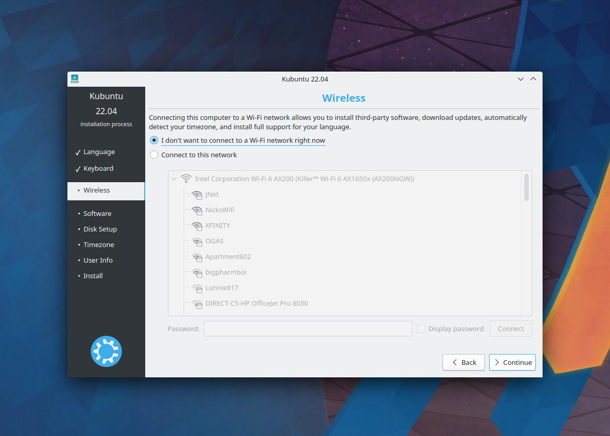
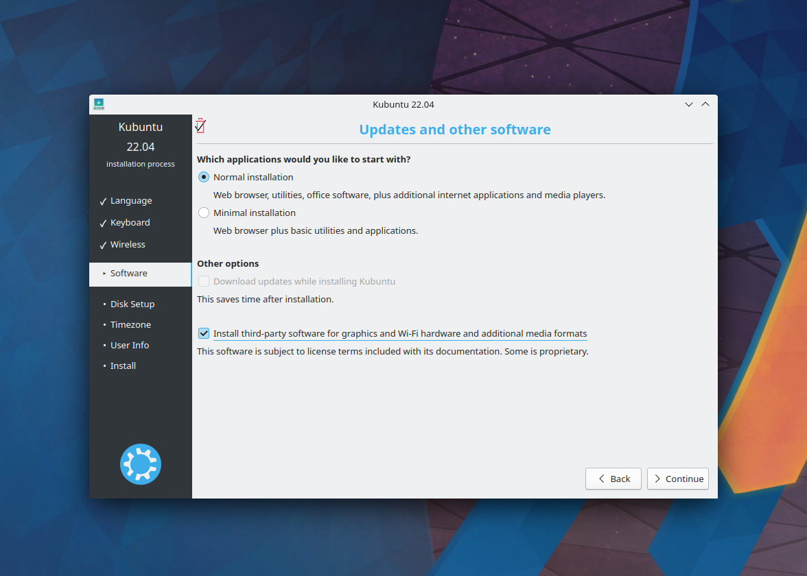
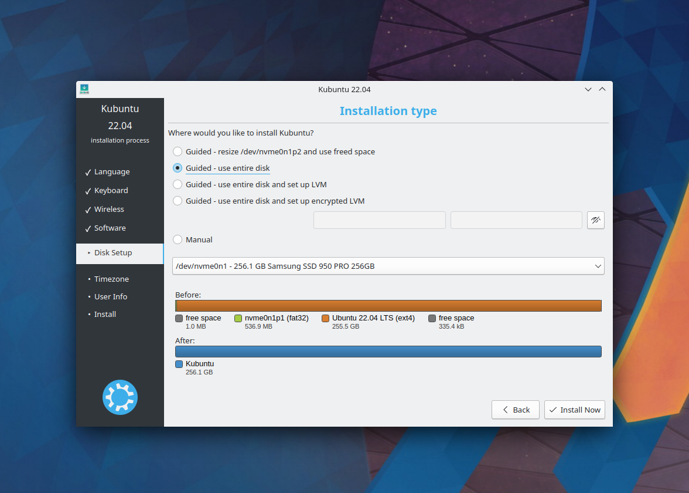
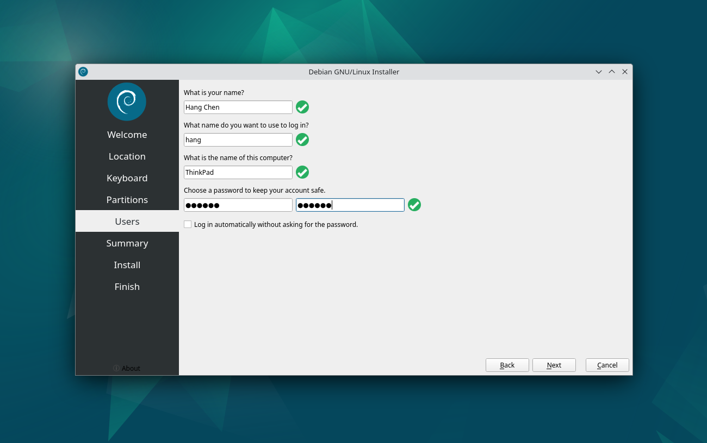
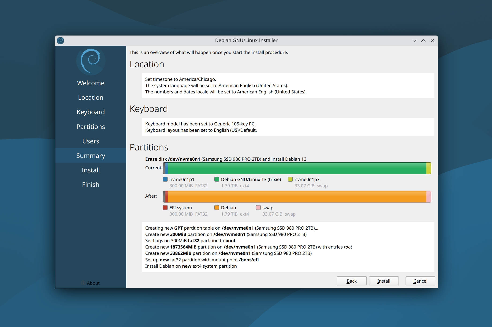
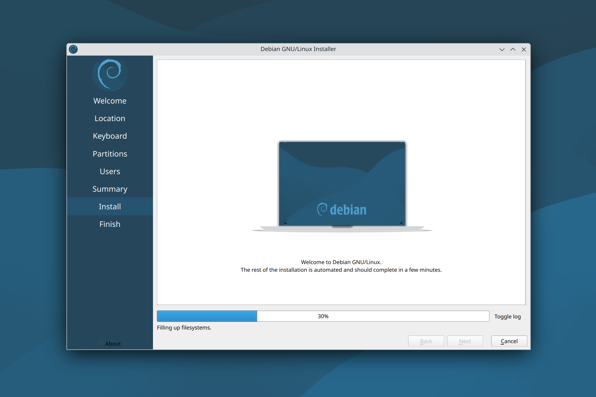
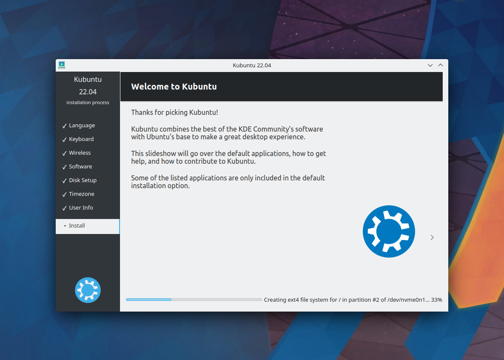
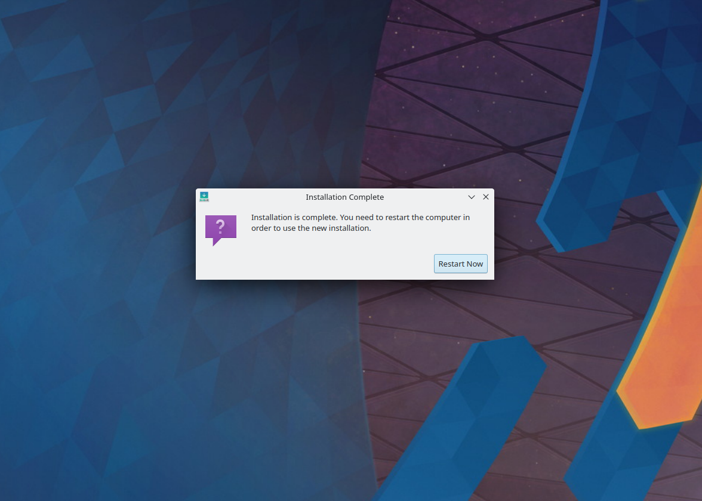

## How to: Perform a Clean Install of Kubuntu

### [1/4] Create a bootable USB drive
- Download [balenaEtcher](https://www.balena.io/etcher/)  
- Download [Kubuntu](https://kubuntu.org/getkubuntu/)  
- Flash a USB drive with the Kubuntu iso image:  


### [2/4] Boot into the USB drive
- Press ```F12``` when the computer is booting up  
- Select the corresponding UEFI boot option (e.g., USB HDD: SanDisk) and hit ```Enter```  

### [3/4] Install Kubuntu

- Once log in to Kubuntu installer, select **Install Kubuntu**":  


- **Continue** with default keyboard setting:  


- **Continue** without connecting to internet:  


- Select **Normal installation** and check **Install third-party software for graphics and Wi-Fi hardware and additional media formats** option, then **Continue**:   


- Select **Guided - use entire disk** and **Install Now**:  


- **Continue** to confirm partition formatting:  


- Set **Region** and **Time Zone**, then **Continue**:  


- Set user account, then **Continue**:  


- Installation might take some time:  


- Once finished, it will prompt a restart:  


### [4/4] Reboot the system
- Once log out, it will prompt "**Please remove the bootable USB flash drive and press Enter**", simply unplug the USB drive and press ```Enter```  
