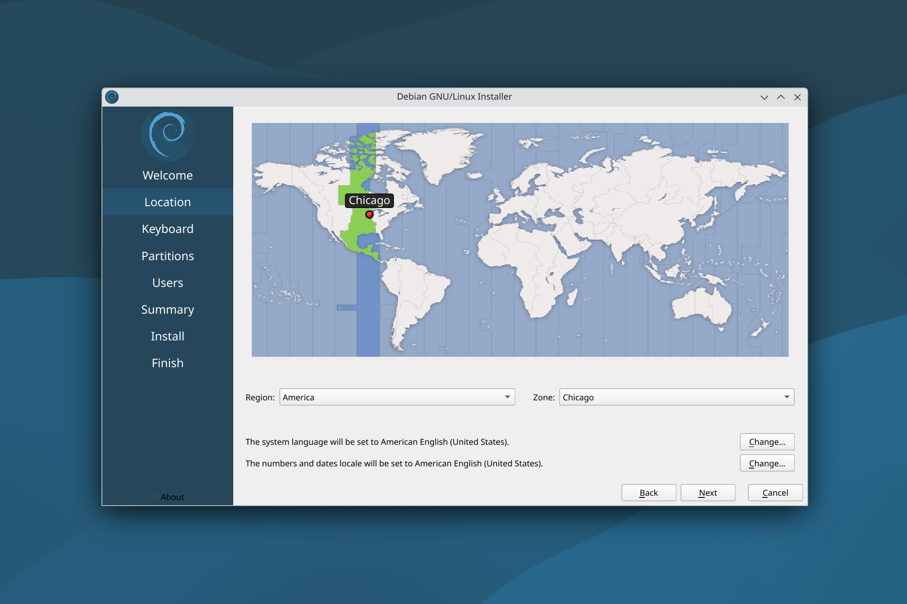

## Fresh Install and Configuration of Debian (KDE) for Work

### [1/4] Create a bootable USB drive
- Download [**balenaEtcher**](https://www.balena.io/etcher/)  
- Download [**Debian (KDE)**](https://cdimage.debian.org/debian-cd/current-live/amd64/iso-hybrid/)  
  - Flash a USB drive with the Debian (KDE) iso image:  


### [2/4] Boot into the USB drive
- Press ```F12``` when the computer is booting up  
- Select the corresponding UEFI boot option (e.g., USB HDD: Kingston) and press ```Enter```  

### [3/4] Install Debian (KDE)

- Once it logs in to Debian live session, open **"Install Debian"**:  


- Set language, then **"Next"**:  


- Set region and zone, then **"Next"**:  


- Set default keyboard, then **"Next"**:   


- Select **"Erase disk"**, then **"Next"** (if you plan to install multiple OS on a single physical drive, you might select **"Manual partitioning"**):  


- Set user account, then **"Next"**:  


- **"Install"**:  


- Installation might take some time (if it goes to sleep, the username/password for the live session is **"user/live"**):  


- Once finished, it will prompt a restart:  


### [4/4] Configuration
- Connect to internet
- Copy the below command, paste in [**Konsole**](https://konsole.kde.org/) (terminal) and press ```Enter```:  
```
bash -c "$(curl -fsSL https://raw.githubusercontent.com/chenh19/MyWorkspace/main/setup.sh)"
```
- Enter user password and press ```Enter``` to run:  


#### Note:
- If the text is too small in the Konsole (Terminal) before scaling configuration, you may press ```Ctrl``` + ```+``` to **make the text larger** (this temporary setting will not be saved).
- It will ask a few questions in terms of **configuration preferences**. If you didn't notice immediately, it will simply pause and wait for your input.
