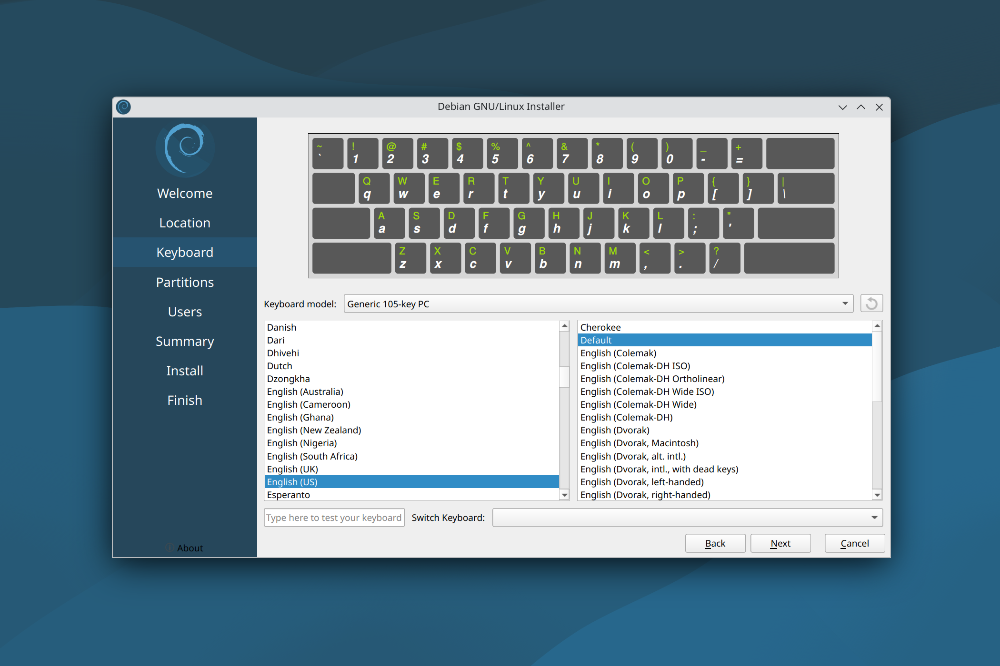
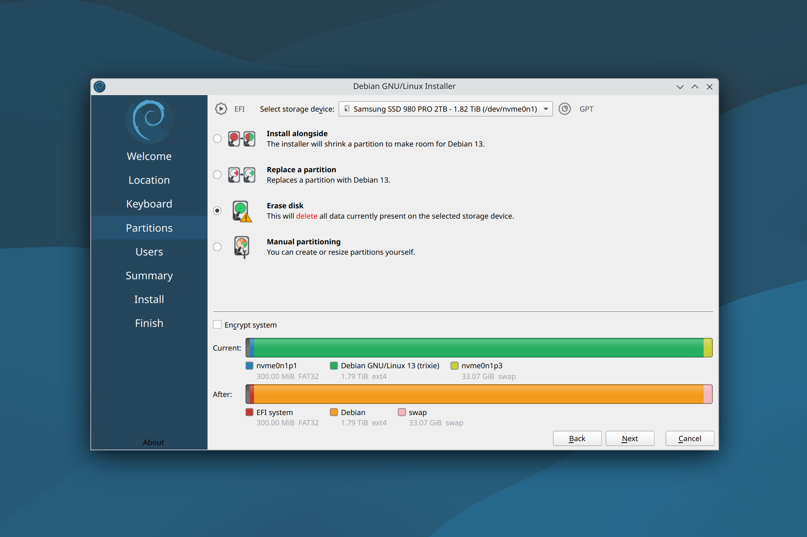
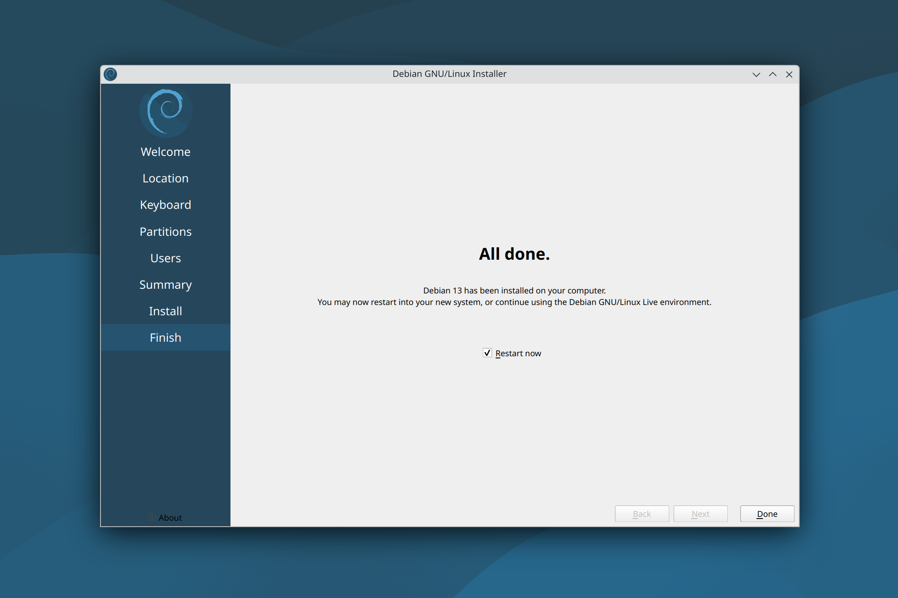

### 1. Create a bootable USB drive
- Download [**balenaEtcher**](https://www.balena.io/etcher/)  
- Download [**Debian (KDE)**](https://cdimage.debian.org/debian-cd/current-live/amd64/iso-hybrid/)  
  - Flash a USB drive with the Debian (KDE) iso image:  

<div style="text-align:center;"></div>
<br>

### 2. Boot into the USB drive
- Press ```F12``` when the computer is booting up  
- Select the corresponding UEFI boot option (e.g., ```USB HDD: Kingston```) and press ```Enter```  

### 3. Install Debian (KDE)

- Once it logs in to Debian live session, open **"Install Debian"**:  

<div style="text-align:center;"></div>
<br>

<details>
<summary>**Note: (click to expand)**</summary>
<div>

- If "Install Debian" is not present on the desktop, you may also access it using the Application Launcher:  

<div style="text-align:center;"></div>
<br>

</div>
</details>

- Set the language, then **"Next"**:  

<div style="text-align:center;"></div>
<br>

- Set the region and the zone, then **"Next"**:  

<div style="text-align:center;"></div>
<br>

- Set the default keyboard, then **"Next"**:   

<div style="text-align:center;"></div>
<br>

- Select **"Erase disk"**, then **"Next"** (if you plan to install multiple OS on a single physical drive, you might select **"Manual partitioning"**):  

<div style="text-align:center;"></div>
<br>

- Set the user account, then **"Next"**:  

<div style="text-align:center;"></div>
<br>

<details>
<summary>**Note: (click to expand)**</summary>
<div>

- Since the release of Debian 13, password policies have become more stringent. However, if you need to set a shorter password (e.g., 6 digits), you may execute the below command in the Konsole (it will automatically exit once it's finished) and try installing the system again:

<p style="text-indent: 2em;">```sudo sed -i '18,$d' /etc/calamares/modules/users.conf && exit```</p>

<div style="text-align:center;"></div>
<br>

</div>
</details>

- **"Install"**:  

<div style="text-align:center;"></div>
<br>

- Installation might take some time (if it goes to sleep, the "username/password" for the live session is **"user/live"**):  

<div style="text-align:center;"></div>
<br>

- Once finished, it will prompt a restart:  

<div style="text-align:center;"></div>
<br>

### 4. Configuration
- Connect to the internet
- Copy the below command, paste in the [**Konsole**](https://konsole.kde.org/) (terminal) and press ```Enter```:  

<p style="text-indent: 2em;">```bash -c "$(curl -fsSL https://raw.githubusercontent.com/chenh19/MyWorkspace/main/setup.sh)"```</p>

- Type your user password and press ```Enter``` to run:  

<div style="text-align:center;"></div>
<br>


<details>
<summary>**Note: (click to expand)**</summary>
<div>

- If the text is too small in the Konsole (Terminal) before the scaling configuration, you may press ```Ctrl``` + ```+``` to **make the text larger** (this temporary setting will not be saved).
- It will ask a few questions in terms of **configuration preferences**. If you didn't notice immediately, it will simply pause and wait for your input.
- Once finished, it will prompt a **reboot**.

</div>
</details>

### 5. End

- All done, enjoy!  

<div style="text-align:center;"></div>
<div style="text-align:center;">(Windows-style dekstop layout)</div>
<br>

<div style="text-align:center;"></div>
<div style="text-align:center;">(Mac-style dekstop layout)</div>
<br>
