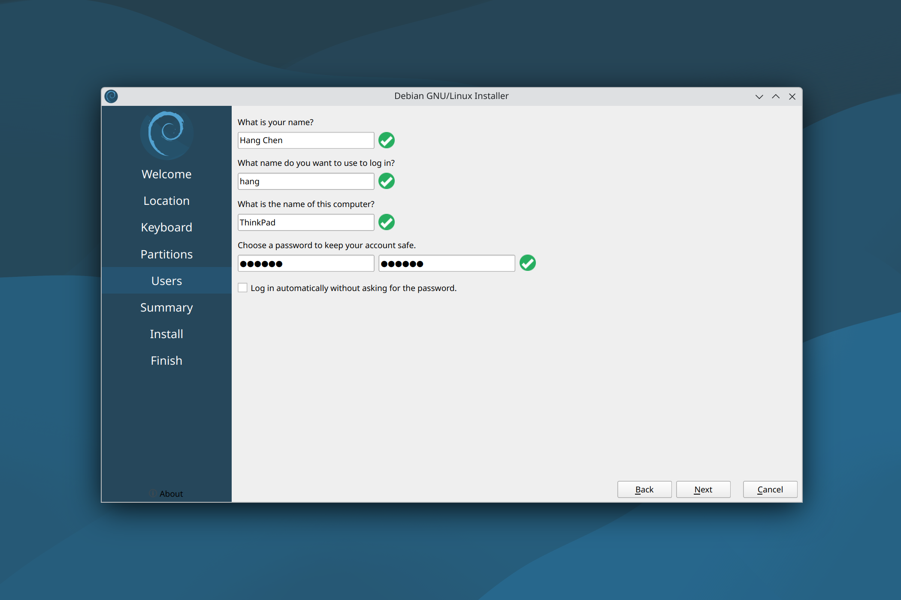

## How to: Perform a Clean Install of Kubuntu

### [1/4] Create a bootable USB flash drive

### [2/4] Press F12 to enter BIOS

### [3/4] Install Kubuntu

### [4/4] Remove the bootable USB flash drive and press Enter
